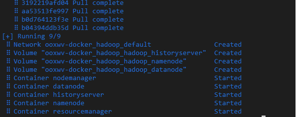
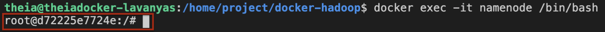
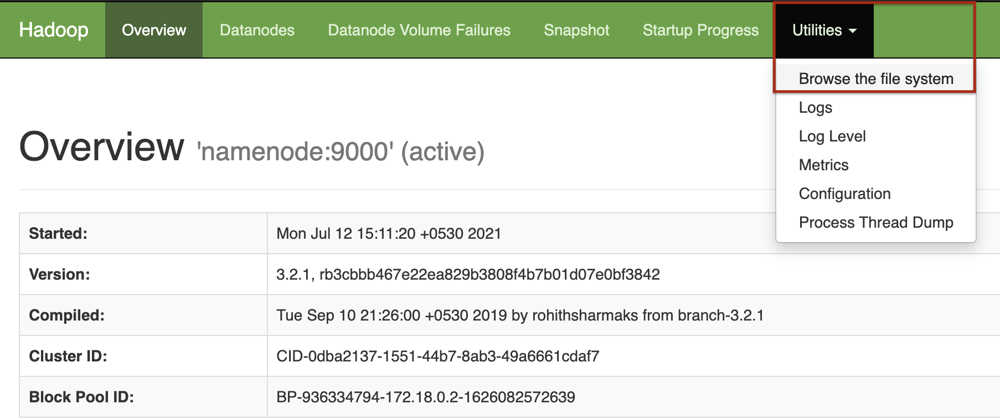
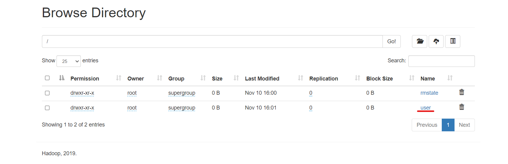
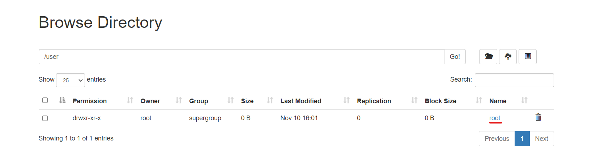
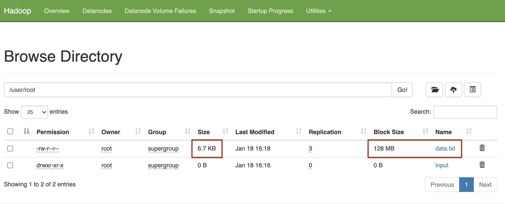
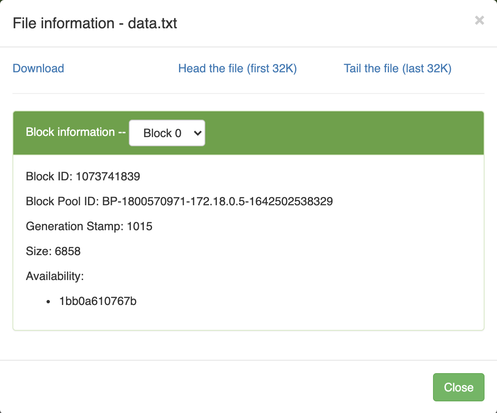

## What is a Hadoop Cluster?
A Hadoop cluster is a collection of computers, known as nodes, that are networked together to perform parallel computations on big data sets. The Name node is the master node of the Hadoop Distributed File System (HDFS). It maintains the meta data of the files in the RAM for quick access. An actual Hadoop Cluster setup involves extensives resources which are not within the scope of this lab. In this lab, you will use dockerized hadoop to create a Hadoop Cluster which will have:

    1. Namenode
    2. Datanode
    3. Node Manager
    4. Resource manager
    5. Hadoop history server

## Set up Cluster Nodes Dockerized Hadoop

    1. Clone the repository to your theia environment.

        git clone https://github.com/ibm-developer-skills-network/ooxwv-docker_hadoop.git

    2. Navigate to the docker-hadoop directory to build it.
    
    3. Compose the docker application.
    
        docker-compose up -d

    4. Compose is a tool for defining and running multi-container Docker applications. It uses the YAML file to configure the serives and enables us to create and start all the services from just one configurtation file.

    You will see that all the five containers are created and started.

        

    Run the namenode as a mounted drive on bash.
    
        docker exec -it namenode /bin/bash

    You will observe that the prompt changes as shown below.
    
        

## Explore the hadoop environment
    As you have learnt in the videos and reading thus far in the course, a Hadoop environment is configured by editing a set of configuration files:

        - hadoop-env.sh Serves as a master file to configure YARN, HDFS, MapReduce, and Hadoop-related project settings.

        - core-site.xml Defines HDFS and Hadoop core properties

        - hdfs-site.xml Governs the location for storing node metadata, fsimage file and log file.

        - mapred-site-xml Lists the parameters for MapReduce configuration.

        - yarn-site.xml Defines settings relevant to YARN. It contains configurations for the Node Manager, Resource Manager, Containers, and Application Master.

        For the docker image, these xml files have been configured already. You can see these in the directory /opt/hadoop-3.2.1/etc/hadoop/ by running

    
        ls /opt/hadoop-3.2.1/etc/hadoop/*.xml

## Create a file in the HDFS
    - In the HDFS, create a directory structure named user/root/input.
   
         hdfs dfs -mkdir -p /user/root/input

    - Copy all the hadoop configuration xml files into the input directory.
    
        hdfs dfs -put $HADOOP_HOME/etc/hadoop/*.xml /user/root/input

    - Create a data.txt file in the current directory.
    
        curl https://raw.githubusercontent.com/ibm-developer-skills-network/ooxwv-docker_hadoop/master/SampleMapReduce.txt --output data.txt

    - Copy the data.txt file into /user/root.
    
        hdfs dfs -put data.txt /user/root/

    - Check if the file has been copied into the HDFS by viewing its content.
    
        hdfs dfs -cat /user/root/data.txt

## View the HDFS
    Click the button below or click on the Skills Network button on the left, it will open the “Skills Network Toolbox”. Then click the Other then Launch Application. From there you should be able to enter the port number as 9870 and launch.
    View HDFS

    This will open up the Graphical User Interface (GUI) of the Hadoop node. Click on Utilities -> Broswe the file system to browse the files.
        
        
    
    View the files in the directories that you have just created by clicking on user then root.

        

        

        
    Notice that the block size is 128 MB though the file size is actually much smaller. This is because the default block size used by HDFS is 128 MB.

    You can click on the file to check the file into. It gives you information about the file in terms of number of bytes, block id etc.,

        